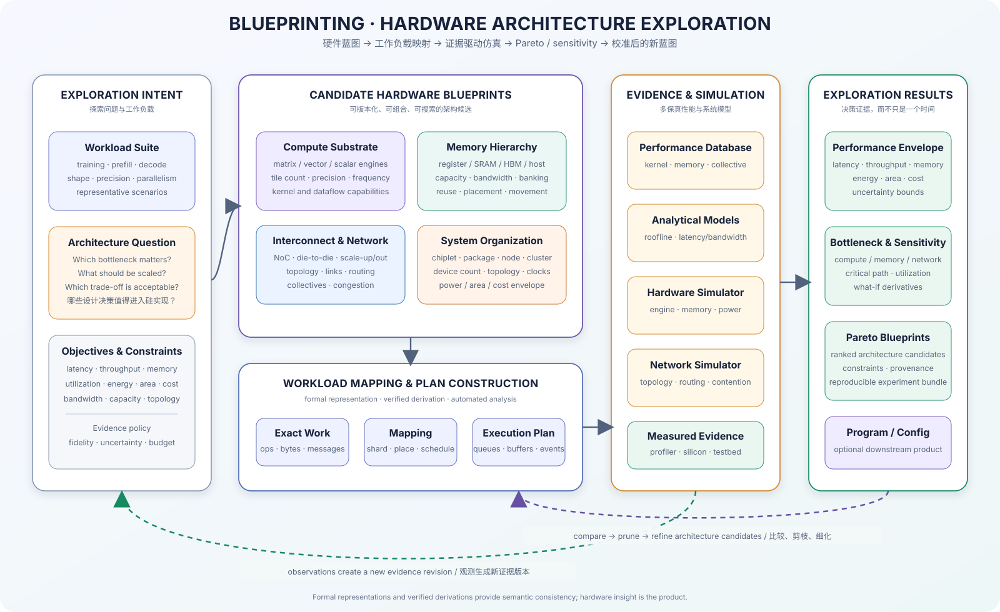

# Blueprinting

[](https://www.python.org/downloads/)
[](LICENSE)
[](https://github.com/astral-sh/ruff)
[](https://deeplink-org.github.io/Blueprinting/)

Blueprinting is an evidence-driven hardware architecture exploration and simulation system for distributed AI
workloads. It maps representative workloads onto candidate compute, memory, interconnect, and system blueprints,
then compares their feasibility, bottlenecks, sensitivity, and performance trade-offs from versioned evidence.

## Hardware exploration model



```text
architecture question + workload suite
  -> candidate hardware blueprints
  -> legal workload mappings
  -> analytical / network / hardware simulation
  -> bottleneck, sensitivity, uncertainty, and Pareto analysis
  -> measured evidence and calibrated revisions
```

The name is the product thesis: a blueprint is detailed enough to map, simulate, compare, revise, and eventually
hand to a hardware or runtime implementation. Existing GPUs, future LPUs, and other accelerators are candidates in
the same exploration space.

The analysis engine uses typed formal models and verified derivations to keep comparisons honest:

- every candidate receives the same exact workload operations, bytes, messages, and dependencies;
- architecture capabilities and resources bind late, so GPU, LPU, and experimental designs remain comparable;
- predicted behavior belongs to versioned evidence rather than semantic workload fields;
- the target architecture requires simulation and optional program emission to consume the same verified architecture-bound execution-plan envelope.

The implementation borrows IR, lowering, transactional passes, and verifiers from compiler engineering. Here they
encode staged refinement and executable verification obligations; they are not a standalone Compiler component or the project's
identity.

Start with [Why Blueprinting](docs/exploration/index.en.md) / [为什么叫 Blueprinting](docs/exploration/index.zh.md), then
continue with the [hardware design space](docs/exploration/design-space.en.md). The formal derivation, verification,
representation, and transformation contracts live under Formal Analysis Foundations.

## Current implementation

The current implementation is a workload-analysis and evidence foundation for the target exploration system. It
provides:

- immutable schemas and structural verifiers for the current five-layer IR backbone; only the first three layers have a production derivation slice, while `ConcretePlanIR` and `MachineIR` remain experimental contracts;
- stable IDs, lineage, schema-versioned serialization, content digests, and typed binding sessions;
- declarative transformation contracts with analysis invalidation and derivation checkpoints;
- typed decoder-only Transformer training and static prefill/decode frontends;
- `ModelIR -> DistributedTaskIR -> PortablePlanIR` staged derivation with explicit TP collectives, recomputation,
  KV state, workload, and buffer facts;
- peak-only, hardware-evidence, database, and explicit roofline fallback cost views;
- reproducible Calculon/SeqSel and Vidur comparison gates that remain downstream of derivation.

First-class architecture blueprints, hardware design variables, concrete resource simulation, network/hardware
simulator adapters, bottleneck/sensitivity reports, energy/area/cost models, and Pareto search are planned product
slices. MachineIR emission remains an optional downstream validation path for GPU, LPU, and other targets.

The near-term architecture-bound deliverable is a provenance-carrying timeline bundle derived from a verified concrete
plan—not a return to a timestamp-authoritative `TimelineIR`. See the [timeline staging path](docs/design/timeline-path.en.md)
and the [architecture risk register](docs/project/risks.en.md).

## Installation

```bash
git clone https://github.com/DeepLink-org/Blueprinting.git
cd blueprinting
pip install -e .
```

For development and documentation tooling:

```bash
pip install -e ".[dev,docs]"
```

## Build the current Transformer workload blueprint

```python
from blueprinting.synthesizer.lowering import (
    DistributeTransformerTrainingPass,
    PlanTransformerTrainingPass,
)
from blueprinting.synthesizer.frontend import build_transformer_model_ir, synthesis_session_for
from blueprinting.synthesizer.passes import PassManager, PassPipeline
from blueprinting.mapping import TransformerTrainingMappingSpec
from blueprinting.workload import TransformerModelSpec, TransformerTrainingWorkloadSpec

model = TransformerModelSpec.from_mapping("gpt3-175B", model_config)
workload = TransformerTrainingWorkloadSpec.from_mapping(execution_config)
mapping = TransformerTrainingMappingSpec.from_mapping(execution_config)
source = build_transformer_model_ir(model, datatype=workload.datatype)

result = PassManager().run(
    PassPipeline.of(
        DistributeTransformerTrainingPass(),
        PlanTransformerTrainingPass(),
    ),
    source,
    session=synthesis_session_for(model, workload, mapping),
)

portable_plan = result.ir
for checkpoint in result.checkpoints:
    print(checkpoint.pass_name, checkpoint.ir.digest)
```

The adapter reads the retained model/execution JSON presets in `data/`, then separates workload facts from the
logical mapping. Invalid topology such as `world_size != tp * pp * dp` is rejected at the typed frontend boundary.

## Reproduce the Calculon calibration

```bash
.venv/bin/python examples/calculon_calibration.py
.venv/bin/python examples/calculon_calibration.py \
  --output examples/calculon_calibration_result.json
```

The experiment derives operation, memory, collective, recomputation, and pipeline facts through typed workload
analysis.
Calculon and SeqSel measurements enter only after workload derivation and estimation, as comparison oracles. The methodology and current
results are documented in the [Calculon calibration experiment](docs/experiments/calculon-calibration.en.md).

## Interactive workbench and CLI tools

The primary architecture workbench is a NiceGUI single-page application backed directly by the framework-neutral
`BlueprintingService`:

```bash
uv run blueprinting-workbench
blueprinting --help
```

It provides a shared configuration surface for single-point analysis, canonical IR derivation audit, and bounded
TP/PP/DP strategy exploration. Analysis runs outside the UI event loop, and failed candidates remain visible as
structured diagnostics.

The existing Calculon Streamlit tools remain isolated as an optional legacy interface. Floating-point analysis is available in the primary NiceGUI workbench:

```bash
uv sync --extra legacy-ui
uv run streamlit run streamlit_app.py
```

Calculon remains an adjacent calibration utility and does not participate in the Blueprinting product analysis path.

## Repository layout

```text
src/blueprinting/schema/       # dependency-free codec and immutable schema primitives
src/blueprinting/workload/     # target-neutral model and scenario facts
src/blueprinting/mapping/      # logical strategies and explicit deployment mappings
src/blueprinting/system/       # chip, memory, interconnect, and system profiles
src/blueprinting/synthesizer/  # canonical IR, exact-work dialects, and verified derivation
src/blueprinting/analysis/     # evidence protocols, cost resolution, and projections
src/blueprinting/application/  # framework-neutral analysis services and reports
src/blueprinting/validation/   # external baselines and strict regression gates
src/blueprinting/workbench/    # NiceGUI workbench and legacy presentation adapters

data/evidence/                 # optional external evidence, excluded from the base package
tests/                         # domain, derivation, application, and regression contracts
docs/                          # bilingual MkDocs design, experiment, and project documentation
```

`workload`, `mapping`, and `system` own separate input concerns. `synthesizer` derives canonical plans from workload
and logical-strategy contracts without reading a physical system; `analysis` later evaluates those plans against an
explicit system, deployment mapping, and evidence snapshot. External oracles remain downstream in `validation`.

## Development

```bash
pytest
ruff check src/ tests/ examples/calculon_calibration.py
ruff format --check src/ tests/ examples/calculon_calibration.py
uv run python scripts/check_docs_i18n.py
uv run mkdocs build --strict
```

## License

Blueprinting is released under the [MIT License](LICENSE).

## Acknowledgments

- [Calculon](https://github.com/calculon-ai/calculon) for the retained comparison engine and public validation data.
- The open-source LLM systems community for model and hardware configurations.
