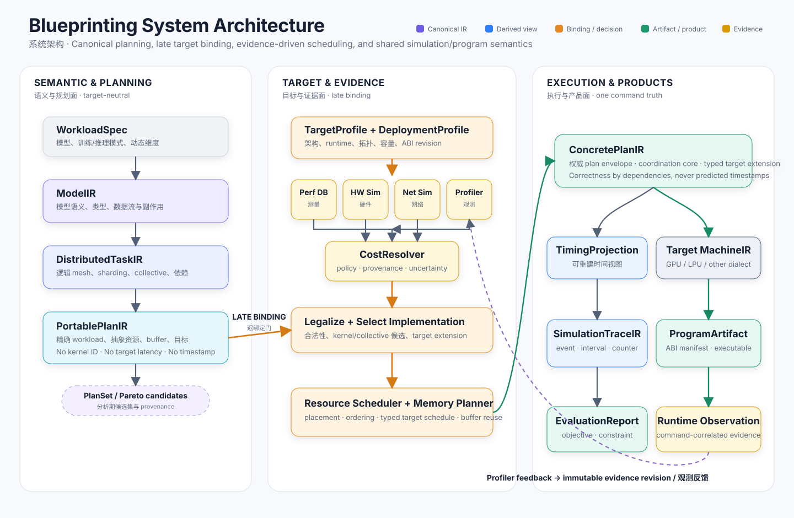
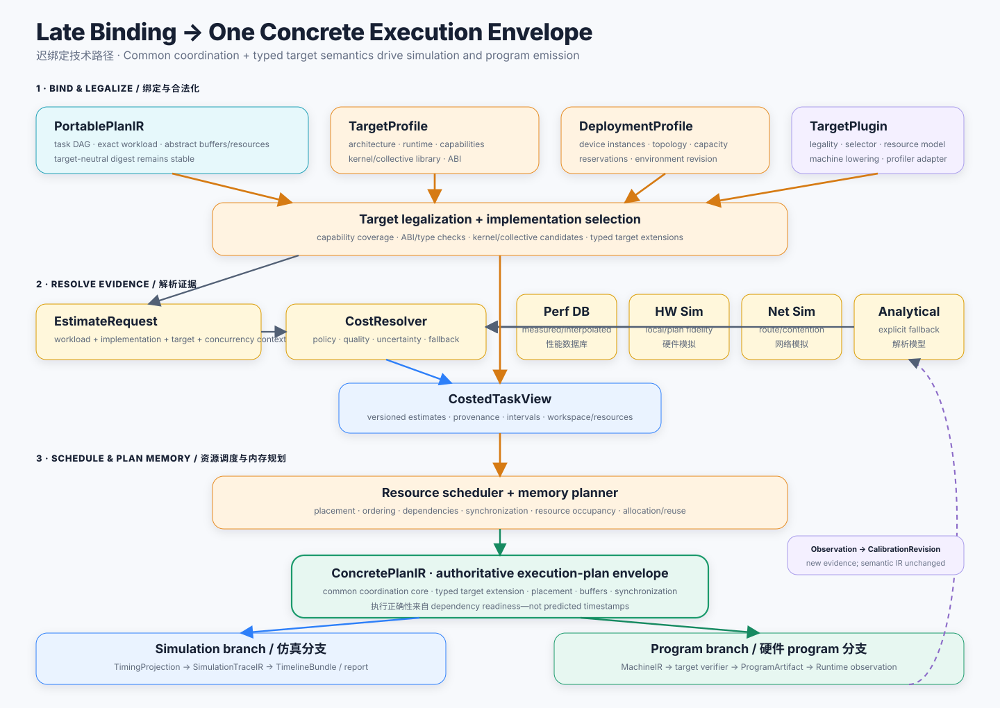

# 形式化分析架构

Blueprinting 的产品目标是硬件架构探索与仿真。核心方法是形式化描述 workload、hardware blueprint、mapping、evidence 与 constraint，逐步推导更具体的状态，验证每一项语义和资源义务，再对得到的设计空间进行自动分析。

本节定义这套形式化分析架构。实现中借用了编译工程的 IR、lowering、pass 与 verifier 技术，但 compiler 既不是产品平面，也不是一个独立系统组件。

## 从架构实验到仿真计划

一次 exploration experiment 从以下输入开始：

```text
workload suite
candidate ArchitectureBlueprints
mapping strategy space
deployment envelope
evidence snapshot and fidelity policy
objectives, constraints, seed, and budget
```

系统必须为每个 candidate 产生通过当前阶段 completeness contract 的合法 plan，用于驱动 simulation；当 target backend 存在时，还可以驱动 program emission。这里的 completeness 必须由 verifier coverage 和 target extension 明确定义，不能由“字段看起来齐全”推断。核心工程问题是在不改变 candidate 之间 workload truth 的前提下，按受控顺序消除 unknown。

## 为什么以形式化推导为核心方法

相邻工具通常为 workload analysis、analytical estimation、network simulation、hardware simulation 与 execution 分别维护表示。它们的 formula 与 overlap assumption 容易漂移，使硬件对比无法审计。

Blueprinting 因此采用分阶段、单调的形式化推导；当前以 typed representation 与 verified transformation pipeline 实现：

```text
ModelIR                workload semantics
  -> DistributedTaskIR logical sharding and communication
  -> PortablePlanIR    architecture-independent mapping intent
  -> ConcretePlanIR    architecture-bound resources and execution plan
  -> MachineIR         optional target program representation
```

每个 transition 保持上游语义，解析一类明确决策，消解显式 proof obligation，并创建可观察 immutable checkpoint。这样，architecture comparison 不再是一组互不相干的公式，而成为一条可检查推导链。

## 三个分析平面



形式化分析架构包含三个平面：

1. **Semantic and Mapping Plane** 拥有 workload truth、distributed decomposition、exact work 与 portable mapping alternative；
2. **Architecture and Evidence Plane** 拥有 candidate hardware resource、legality、deployment context、implementation choice 与 cost evidence；
3. **Simulation and Product Plane** 拥有 concrete command、resource trace、report、optional target program 与 observation。

平面之间通过 stable identity/digest 引用。Performance provider 不能修改 workload fact；target plugin 不能重新定义 frontend semantic；simulation trace 不能成为独立 schedule。

## Architecture-Binding Boundary

Target-neutral work 在 `PortablePlanIR` 之前独立于任何 GPU、LPU 或实验 architecture。Candidate `ArchitectureBlueprint`、deployment context 与 evidence policy 在 portable-to-concrete boundary 完成 binding。

边界前可以用 architecture requirement 剪除不可能 option，但 vendor kernel ID、physical engine、memory bank、route、queue 与 target latency 均被禁止。边界后，concrete plan 拥有 selected implementation、placement、synchronization、buffer 与 resource constraint。跨 target 稳定的 coordination semantic 进入 common core；dataflow、route、issue slot 等 target-only correctness semantic 必须进入 namespaced typed extension，不能塞进 free-form metadata。

从 workload 角度看这属于“late binding”。Hardware 仍然是 first-class exploration variable：系统会对许多 candidate blueprint 重复 binding，而不是隐藏一个 global target。

## 共享的 Concrete Execution Plan



在目标架构中，`ConcretePlanIR` envelope（common coordination core + typed target extension）是两个产品共享的 execution source：

```text
ConcretePlanIR + evidence
  -> TimingProjection
  -> SimulationTraceIR
  -> bottleneck / utilization / objective reports

ConcretePlanIR + target plugin
  -> MachineIR
  -> replayable or executable program artifact
```

Simulation 是主要 exploration path；program emission 是可选能力，可以在 hardware/ABI 成熟后再出现。当二者都存在时，共享 command ID、dependency、queue、synchronization 与 buffer，使 measurement 能验证实际被 simulation 的 plan。

当前 v1 schema 只实现通用 device/queue/buffer/command 骨架，尚无 production producer、route/resource-occupancy semantic 或 typed target extension。因此它是 **experimental contract**，不是已经冻结的跨 target ABI。

## Timeline 是阶段性产品

“编译出 timeline”在工程上表示：先构造 verified architecture-bound command plan，再在指定 evidence 与 simulator policy 下派生 predicted interval 和 event trace，并把这些对象连同 provenance 发布为 `TimelineBundle`。

```text
ConcretePlanIR                 correctness and coordination
  + evidence / simulator
  -> TimingProjection          predicted time + uncertainty
  -> SimulationTraceIR         resource-correlated events
  -> TimelineBundle            analysis/replay product package
```

Predictive timestamp 不是 readiness 或 buffer correctness semantic。若 LPU 或其他 target 把 issue cycle/slot 作为程序约束，它只能在 target binding 后作为 typed target semantic 进入 concrete extension 和 `MachineIR`。完整边界与阶段 Gate 见 [Timeline 阶段路径](timeline-path.md)。

## Evidence 位于 Semantic IR 之外

Exact operation、logical byte、message、dependency 与 abstract lifetime 属于 workload/planning IR；throughput、latency、contention、energy、area、cost 与 uncertainty 属于 versioned evidence view。

这种分离使同一 candidate 可以使用 analytical model、performance database、hardware/network simulator 或 measurement 重新评估。改变 evidence 可以改变 ranking 与未来 schedule，却不能追溯改变 workload semantic 或 published experiment。

## Planning、Simulation 与 Calibration

| 阶段 | 职责 | 产品含义 |
|---|---|---|
| Exploration planning | 生成 candidate，映射 workload，legalize、estimate、place、schedule 与 filter | 哪些 blueprint 可行并值得更深评估？ |
| Simulation | 在声明 model 下执行 verified resource plan | 每份 blueprint 如何表现，为什么？ |
| Calibration | 比较 predicted/observed event，再发布 evidence revision | 未来 experiment 应如何更新 target knowledge？ |

Search 可以昂贵，但必须有界且可复现。Runtime 或 simulation execution 不重复无界 global optimization；runtime 仍可保留 target contract 明确允许的 backpressure、failure handling 与其他 bounded mechanism decision。

## 被拒绝的捷径

架构拒绝：

- 一个填满 optional target/timing field 的 universal graph；
- 把 predicted duration 保存为 portable workload semantic；
- 用 global overlap ratio 代替 command/resource scheduling；
- 为匹配 reference table 拟合 model/case-specific coefficient；
- 允许每个 simulator/emitter 重建自己的 schedule；
- 在 frontend 绑定单一 hardware target；
- 平行维护 legacy/new public IR hierarchy。

每种捷径都会降低 architecture candidate 的可比较性或结论的可复现性。

## 当前系统与目标系统

当前贯通路径结束在 `PortablePlanIR`，随后通过 analytical `HardwareProfile` estimate 做验证。五层 typed representation schema、verified transformation transaction、workload derivation 与 Calculon experiment 已经实现，是后续产品的基础。Schema 的内部版本号只标识 serialization contract；在 production producer、独立 consumer 与 migration policy 到位前，不构成 public compatibility 承诺。

First-class architecture blueprint、target/resource binding、concrete scheduling、event simulation、simulator provider、design-space search 与可选 GPU/LPU program emission 仍为 planned 或 contract-only。以[状态页](../project/status.md)为准。

## 如何阅读形式化分析基础

- [推导与验证模型](synthesis-model.md)形式化 state、binding、proof obligation、automated analysis 与 concrete abstract machine。
- [Timeline 阶段路径](timeline-path.md)区分 command plan、预测时间线、强制时序与 LPU backend 演进。
- [完整推导示例](walkthrough.md)展示一个 Transformer fragment 穿过所有 representation。
- [分析模块架构](modules.md)定义 Python ownership 与 extension boundary。
- [形式化表示 reference](ir/index.md)定义 semantic contract。
- [分析与变换 reference](passes/index.md)定义 verified transaction。

这些 internals 服务于[硬件架构探索](../exploration/index.md)与[模型和仿真](../modeling/hardware.md)描述的产品工作流。跨模块未关闭的架构风险集中记录在[风险登记表](../project/risks.md)，不能用愿景文案代替实现 Gate。
