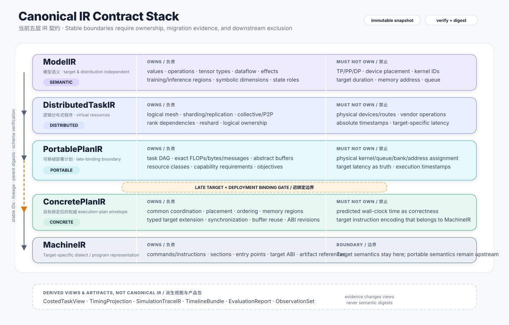

# Formal Representation Stack

The current five canonical representations are refinement boundaries with explicit ownership, not arbitrary Python models. Their concrete types use the `*IR` suffix because Blueprinting borrows typed intermediate representations from compiler engineering. Adding or merging a stable boundary requires an ADR and migration evidence; the current layer count is not an immutable law of nature.



## Representation categories

### Canonical formal representation

A canonical representation owns authoritative semantics for one derivation stage. It has deterministic serialization, stable identity and lineage, a versioned schema, and a verifier. Current code and tables call these representations IRs.

### Derived view

A derived view is reproducibly computed from canonical IR, bindings, evidence, and policy. It may be invalidated and rebuilt and cannot mutate its source. `CostedTaskView`, `TimingProjection`, and `SimulationTraceIR` are derived views.

### Artifact

An artifact packages search, reporting, interchange, or execution output. `PlanSet`, `TimelineBundle`, `EvaluationReport`, `ObservationSet`, and `ProgramArtifact` are artifacts; being serializable does not make them canonical IR dialects.

## Common envelope

Every canonical snapshot contains:

```text
schema_name
schema_version
producer_version
feature_set
content_digest
payload
```

Entities use stable typed IDs. Decomposition records one-to-many lineage; fusion records many-to-one lineage. Snapshots are immutable or transactionally isolated. Types, effects, dependencies, memory semantics, and compatibility-relevant extensions use typed fields rather than free-form dictionaries.

## Python definition sites

The five layers are defined in `src/blueprinting/synthesizer/stages/<layer>/ir.py`; transformations producing each layer are defined directly in the adjacent `passes.py`. The old `synthesizer.ir` and `synthesizer.lowering` compatibility paths are gone, including from internal baseline adapters. See [Python Algebraic IR Authoring](python-algebra.md).

## Ownership summary

| Layer | Owns | Must not own |
|---|---|---|
| `ModelIR` | Values, operations, types, dataflow, effects, model state | Distribution, physical resources, target cost |
| `DistributedTaskIR` | Logical mesh, shards, collectives, rank dependencies | Physical devices, routes, target implementations |
| `PortablePlanIR` | Task DAG, exact work, abstract resources/buffers, strategy choices | Kernel IDs, queues, addresses, predicted time |
| `ConcretePlanIR` | Common coordination core plus typed target-schedule extensions, implementations, placement, ordering, synchronization, buffer plan | Predicted time as correctness, machine encoding |
| `MachineIR` | Target commands or instructions, sections, entry points, ABI | Reinterpretation of portable semantics |

## Information ownership matrix

| Information | First owner | Rule downstream |
|---|---|---|
| Model operation, value, effect | `ModelIR` | Referenced through lineage; never reinterpreted |
| Rank, shard, logical collective | `DistributedTaskIR` | Target stages only select implementations |
| Exact FLOPs, bytes, messages | `PortablePlanIR` | Providers cannot overwrite workload facts |
| Physical device, queue, buffer offset | `ConcretePlanIR` | Simulation and MachineIR consume them |
| Target-only dataflow, route, issue/slot constraints | `ConcretePlanIR` typed extension | Target verifier, simulation, and MachineIR consume the same version |
| Implementation ID | `ConcretePlanIR` | MachineIR encodes it further |
| Target instruction and ABI section | `MachineIR` | Artifact refers to the digest |
| Predicted latency and timestamps | Derived views | Never define correctness |
| Actual runtime duration | `ObservationSet` | Produces a new calibration revision |

## Common verification rules

Every mature canonical contract must verify schema identity, ID uniqueness, reference integrity, lineage validity, deterministic extension encoding, and its layer-specific invariants. A transformation verifies both input and output and records the parent digest. Only the first three layers currently have a production derivation slice; `ConcretePlanIR` and `MachineIR` have experimental schemas and structural verifiers, which do not establish complete target legality.

## Schema evolution

The codec exposes duplicate-safe raw parsing, and `SchemaMigrationRegistry` can register deterministic, acyclic, uniquely resolved version steps. Explicit migrated loads verify the source digest, every intermediate snapshot, the final digest, and the ordered migration IDs. A synthetic test schema exercises chaining, ambiguity rejection, no-op loading, and tamper rejection.

All five IR roots are currently at `0.0.0`. Canonical record and ADT identities are semantic, versionless names; they do not maintain independent component counters. The production migration registry is empty until a schema is graduated and a real compatibility boundary exists. Snapshots missing required features are still rejected.

## Reference pages

- [Model and Distributed IR](model-distributed.md) defines target-neutral program and logical-distribution semantics.
- [Planning and Execution IR](planning-execution.md) defines portable planning, the target-binding gate, concrete commands, MachineIR, and derived products.
- [Python Algebraic IR Authoring](python-algebra.md) defines source layout, record/ADT deriving, and the explicit semantic boundary.
