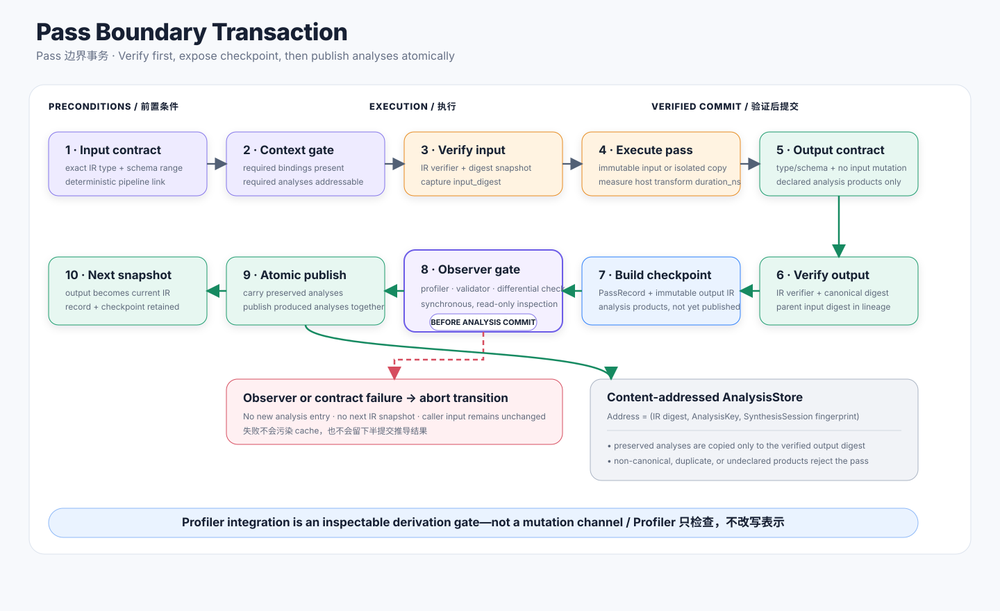

# 分析与变换基础设施

Blueprinting 的 `Pass` 是当前实现中对 immutable derivation state 执行 verified transaction 的单元。这个机制借自编译工程；它在架构中的职责是显式表达 analysis dependency、transformation authority、proof obligation、profiler checkpoint 与 cache effect。



## Transformation Contract

每个 Pass 声明：

```text
pass identity 与 contract digest
input IR type and accepted schema range
output IR type and produced schema version
required bindings
required analyses
preserved analyses
produced analyses
mutation model
verification policy
determinism and seed usage
带独立 semantic invariant 的 typed lineage relation
可执行 canonical normal form
```

Pipeline 根据这些 contract 组合，而不是对具体 Pass class 进行 `isinstance` 判断。

Production pass 使用单一低噪声 authoring syntax：`relation()` 同时声明 typed entity mapping、独立 executable semantic invariant 与可选具名 `claim`；`@derivation` 从 `DerivationPass[SourceIR, TargetIR]` 推导 IR 类型与精确 schema，并绑定模块级纯 normalizer。Normalizer 证明 implementation 产出了声明的 canonical construction；relation invariant 独立检查守恒、合法性与 dependency correspondence 等语义事实，不能把 implementation 本身当作自己的证明。Binding、analysis effect 与 relation identity 仍显式声明；唯一的 pass decorator 只构造 metadata，不包装或改变 `run()`。

每个 pass 定义在其输出层：

```text
ModelIR producer            -> stages/model/passes.py
DistributedTaskIR producer  -> stages/distributed/passes.py
PortablePlanIR producer     -> stages/portable_plan/passes.py
ConcretePlanIR producer     -> stages/concrete_plan/passes.py
MachineIR producer          -> stages/machine/passes.py
```

方言模块可以提供纯推导函数，但不能拥有第二个 public pass class，也不能通过 import forwarding 隐藏 contract。

## Transaction 顺序

`PassManager` 执行：

```text
check input type/schema
  -> require declared bindings and analyses
  -> verify input snapshot
  -> execute immutable or isolated mutation
  -> check output type/schema and input immutability
  -> verify output and parent lineage
  -> 解析全部跨 boundary lineage relation
  -> 重新求值 canonical normal form 并要求 snapshot 完全相等
  -> 执行每条 relation 的独立 semantic invariant
  -> create PassRecord and PassCheckpoint
  -> invoke synchronous observers
  -> atomically preserve/publish analyses
  -> commit the output as the next snapshot
```

Exception、verifier failure、observer rejection 或 undeclared analysis product 都会终止 transition。上一份 snapshot 和 analysis store 保持可见且不变。

## Analysis Store

Analysis 地址为：

```text
(IR digest, AnalysisKey, SynthesisSession fingerprint)
```

Pass 列出所有 required、preserved 和 produced analysis。Preserved product 只复制到 verified output digest。Undeclared product 和 noncanonical address 会使 transaction 失败。

Derivation analysis 与 target evidence 使用独立 store。前者关联 representation snapshot 与 typed session；后者关联 estimate request/provider revision。

## Checkpoint 与 Observer

`PassCheckpoint` 在 analysis publication 前暴露 immutable output、schema、digest、pass record、session identity 和 lineage。Synchronous observer 可以执行 stage-specific verification、profiler comparison 或 conservation check。

Observer 是只读的，不能重写 representation 或直接 publish analysis。Checkpoint 被拒绝时，整个 transition 失败，因此 validation 不会留下半接受的 derivation。

## 测量语义

`PassRecord.duration_ns` 测量 host-side transformation wall time。它是 analysis-overhead provenance，永远不是 predicted workload duration。Workload cost 位于 evidence-backed view。

## 确定性

Pass 声明自己是否 deterministic，以及如何使用 seed。CI 与可选的 `PassManager` verification 会在相互隔离的 analysis-store snapshot 上执行 deterministic pass 两次，并比较 output digest 与 analysis-product digest；正常 production execution 默认关闭 replay。同 seed 结果不一致会在发布前终止 transaction。

Search pass 可以具有 seed 和 budget。Candidate order、pruning 和 rejection reason 都保留 provenance，使 search result 可以 replay。

## Analysis 与 Transformation 文档模板

每个 production analysis 或 transformation design 必须包含：

1. 问题与 decision authority；
2. input assumption 和 required analysis；
3. transformation algorithm 或 pseudocode；
4. before/after IR example；
5. preserved semantic 与 output invariant；
6. complexity 与 search budget；
7. diagnostic 与 fallback policy；
8. checkpoint 与 profiler integration；
9. implementation/test mapping。

## 当前实现

仓库在 `src/blueprinting/synthesizer/passes/base.py` 中实现 transaction runner，在 `passes/deriving.py` 中实现内部 registry，并通过 `passes/authoring.py` 只向扩展作者暴露 `@derivation`、`relation` 与 `claim`。各层 public pass 位于 `stages/*/passes.py`。Contract inference、failure behavior 与 determinism 由 `tests/synthesizer/test_pass_manager.py` 覆盖。
