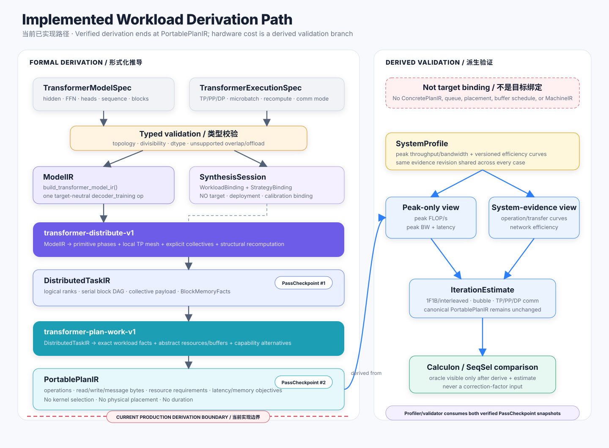

# Transformer Workload Derivation

The implemented Transformer slice is deliberately narrow and auditable: it imports one typed decoder-training workload, formally derives one local tensor-parallel block, and preserves exact work in a target-neutral portable plan. It validates the first half of the analysis architecture without pretending that target scheduling already exists.



## Scope and boundary

The production path is:

```text
TransformerModelSpec + TransformerTrainingWorkloadSpec + TransformerTrainingMappingSpec
  -> ModelIR
  -> DistributeTransformerTrainingPass
  -> DistributedTaskIR
  -> PlanTransformerTrainingPass
  -> PortablePlanIR
```

The red boundary in the figure is intentional. `SystemProfile` is consumed only by a derived estimate after `PortablePlanIR`; it is not an implicit target binding and it does not make `ConcretePlanIR` available.

This page covers decoder-only training at block scope; the repository separately implements a static inference prefill/decode phase slice. Full-model PP/DP task graphs, complete intermediate-buffer lifetimes, target legalization, and physical scheduling remain subsequent work.

## Typed semantic import

`TransformerModelSpec` owns dimensions and model semantics. `TransformerTrainingWorkloadSpec` owns global/micro batch size and datatype. `TransformerTrainingMappingSpec` owns TP/PP/DP, recomputation, pipeline interleaving, optimizer sharding, and tensor-parallel communication mode. `synthesis_session_for()` converts these independent contracts into explicit workload and strategy bindings.

Physical network-tier selection is deliberately absent. `NetworkTierBinding` is supplied only when a portable plan is evaluated against a `SystemProfile`; changing it cannot change the model, distributed, or portable-plan digest.

The importer rejects invalid dimensions, TP divisibility failures, sequence dimensions that cannot be evenly partitioned under RS+AG, invalid parallel topology, and inconsistent workload or strategy facts before a pass runs. At TP=1, AR and RS+AG have identical local work and memory semantics. `build_transformer_model_ir()` then creates a coarse, target-neutral `transformer.decoder_training` operation. No target name, peak rate, kernel ID, or latency enters this snapshot.

## Static workload derivation

`derive_transformer_block()` decomposes a block into typed `PrimitiveInvocation` records. Each invocation has a phase, engine class, exact operations, exact read/write bytes, and—when applicable—collective kind and logical message bytes.

The analysis follows data dependencies rather than fitted ratios. For a linear layer `Y[M,K] = X[M,N] x W[N,K]`, forward, activation-gradient, and weight-gradient work are three explicit matrix multiplications. Attention, normalization, activation, dropout, residual, and optimizer work are represented separately.

Recomputation is also structural. Full recomputation clones the required forward invocations; selective recomputation clones only the selected attention path. Sequence-parallel recommunication is a distinct collective invocation. Consequently every added operation and byte remains attributable to a semantic cause.

## Distribution derivation

`DistributeTransformerTrainingPass` consumes `ModelIR` plus workload and strategy bindings and introduces:

- a logical TP mesh and logical ranks;
- forward, recompute, backward, optimizer, and recommunication tasks;
- explicit all-reduce, reduce-scatter, or all-gather collectives;
- distributed boundary values and sharding;
- stable lineage from every task and value to its model source.

The current block has explicit, conservative forward, recompute, backward, and optimizer stage ordering, while remaining serial within each stage. The external block output is produced at the forward terminal; optimizer work cannot masquerade as its activation producer. This is a stage-level correctness baseline, not a claim that no target can overlap work; primitive-level activation/gradient SSA and exact lifetimes are not yet materialized. Physical queues, routes, collective algorithms, and overlap are forbidden at this layer because they require target and deployment knowledge.

The pass must preserve workload semantics and satisfy these checks:

1. the logical mesh size agrees with the strategy;
2. every rank and dependency resolves;
3. shard rank, mesh axes, ownership, and references are valid;
4. collective participants, reduction semantics, and non-negative message volumes are structurally well formed;
5. the output records the source `ModelIR` digest.

## Portable-plan derivation

`PlanTransformerTrainingPass` converts each distributed task into a `PlanTask`. It retains `WorkloadFacts`, declares abstract resource demand, creates capability-based implementation requirements, assigns logical concurrency groups, and introduces boundary buffers and objectives.

The pass may say that a task needs `matrix-multiply`, `vector-elementwise`, or a collective capability. It may not select a CUDA kernel, LPU opcode, physical device, memory bank, queue, or duration. Those are decisions of the portable-to-concrete gate.

The resulting plan is suitable for exact-work comparison and target-neutral pruning. It is not yet a complete execution plan: the current implementation has only boundary buffers and does not encode all intermediate lifetimes.

## Checkpoints and profiler integration

Both passes run through `PassManager`. After output verification, a `PassCheckpoint` exposes the immutable IR, schema, digest, pass record, session fingerprint, and lineage to synchronous observers.

Useful stage checks include:

| Checkpoint | Independent checks |
|---|---|
| `DistributedTaskIR` | primitive count, phase coverage, mesh/rank consistency, collective volume, recompute expansion |
| `PortablePlanIR` | operations and byte conservation, resource coverage, buffer legality, absence of target fields |

An observer may compare facts with a framework trace or reference model and reject the transition. It may not mutate the representation or write undeclared analyses. Host-side transformation duration is recorded separately from predicted workload time.

## Failure model and diagnostics

Typed inconsistency is reported at the earliest boundary: missing strategy bindings, mismatched workload/execution facts, unsupported semantic operation, malformed invocation, or verifier failure. A failed pass publishes neither its output snapshot nor preserved/produced analyses.

The derivation does not compensate for a discrepancy by reading a reference latency or attaching a case-specific coefficient. A disagreement is localized to semantic import, work derivation, distribution, cost evidence, or schedule composition and fixed at that boundary.

## Implementation map

| Concern | Source | Tests |
|---|---|---|
| Model and training-workload contracts | `src/blueprinting/workload/transformer.py` | binding and validation tests |
| Logical mapping contract | `src/blueprinting/mapping/transformer.py` | boundary and validation tests |
| Workload-to-IR frontend | `src/blueprinting/synthesizer/frontend/transformer.py` | canonical representation and calibration tests |
| Workload algebra | `src/blueprinting/synthesizer/dialects/transformer/training.py` | `tests/validation/test_calculon.py` |
| Two derivation passes | `src/blueprinting/synthesizer/lowering/transformer.py` | `tests/synthesizer/test_transformer_training.py` and calibration tests |
| Transaction/checkpoints | `src/blueprinting/synthesizer/passes/base.py` | `tests/synthesizer/test_pass_manager.py` |
| Evidence-derived estimates | `src/blueprinting/analysis/cost_model.py` | validation tests |
| Calculon/SeqSel oracle gate | `src/blueprinting/validation/calculon.py` | `tests/validation/test_calculon.py` |

The [Calculon calibration experiment](../../experiments/calculon-calibration.md) is the end-to-end audit of this implemented slice.
