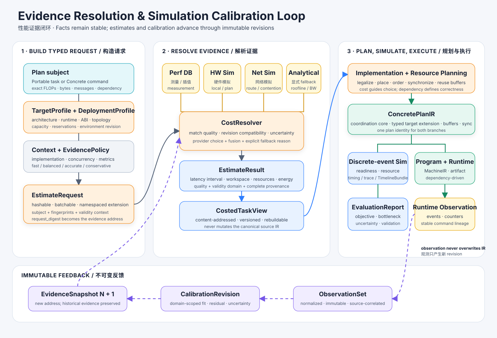

# Performance Evidence and Cost Models

Performance evidence turns a hardware blueprint into a falsifiable prediction. Blueprinting keeps evidence outside workload and architecture semantics: exact work is a property of the mapped workload, while latency, energy, utilization, area, and cost are statements about a mapping, architecture, deployment, method, context, and revision.



## Four kinds of truth

The system keeps four categories separate:

| Category | Examples | Owner |
|---|---|---|
| Workload facts | operations, read/write bytes, message bytes, dependencies | canonical IR |
| Architecture facts | engine hierarchy, supported dtypes, memory capacity, topology | architecture blueprint and deployment profile |
| Estimates | latency, energy, utilization, uncertainty | evidence providers and cost views |
| Observations | measured event intervals, counters, memory use, communication | immutable observation sets |

An observation may calibrate a future estimate revision. It does not rewrite historical evidence or workload facts. An estimate may guide scheduling. It does not add correctness edges to the command DAG.

## Evidence flow

The normal flow is:

```text
canonical task + candidate architecture + legal implementation + execution context
  -> EstimateRequest
  -> CostResolver(policy, evidence snapshot)
  -> one or more EstimateProviders
  -> normalized EstimateResult
  -> CostedTaskView
  -> scheduling / timing / simulation
  -> ObservationSet
  -> CalibrationRevision
  -> new immutable evidence snapshot
```

Every arrow is typed and content-addressed. The resolver records which provider answered, its raw source revision, calibration revision, validity domain, fallback status, and uncertainty.

## Provider classes

Providers may include:

- measured kernel and collective databases;
- analytical roofline or communication models;
- hardware simulators and vendor performance models;
- network simulators or topology-aware collective models;
- calibrated surrogate models built from immutable observations.

These providers implement one normalized protocol. Blueprinting does not import simulator-specific schemas into canonical workload or architecture objects, and it does not sum every available answer. A policy selects the most appropriate admissible source and preserves alternatives for comparison when requested.

## Two evaluation levels

Task-level estimation predicts one legal implementation in a declared context: shapes, dtype, resource, placement class, concurrency state, and environment. Plan-level evaluation composes tasks through the concrete dependency graph and resource model.

This distinction avoids a common error: treating independent task latencies as an end-to-end schedule. Overlap, serialization, contention, bubbles, and buffer pressure are properties of a plan and deployment, not a scalar kernel record.

## Uncertainty and validity

Every estimate declares a validity domain and uncertainty representation. At minimum it records whether the answer is measured, simulated, analytical, calibrated, extrapolated, or fallback. Extrapolation distance and missing context are visible to Pareto and risk policies.

A planner may optimize expected latency, a conservative bound, or a risk-adjusted objective. It may not silently convert an unknown cost to zero or treat a low-confidence extrapolation as an exact measurement.

## Profiler correlation by layer

Stable lineage allows observations to be aggregated at several semantic levels:

| Correlation level | Typical question |
|---|---|
| Model operation | Is the high-level decomposition complete? |
| Distributed task | Is sharding or collective volume correct? |
| Portable task | Are exact work and capability requirements correct? |
| Concrete command | Did queueing, contention, or overlap match the plan? |
| Machine instruction | Is implementation or ABI behavior responsible for error? |

This does not mean every stage is assigned a wall-clock duration. Early stages are checked by semantic and conservation facts; concrete stages can additionally be checked by event time.

## Current implementation boundary

The repository now provides normalized `CostQuery`/`CostEstimate` contracts, ordered `CostResolver` policy, analytical `RooflineCostProvider`, an immutable exact-selector `PerformanceDatabase`, generic simulator table ingestion, and explicit Vidur and AIConfigurator importers. Static inference derives queries from portable task facts and resolves both task and pipeline communication costs. It still separates admissible cost providers from the read-only `InferenceBaseline.lookup()` comparison contract.

This remains an implemented slice, not a complete architecture-exploration evidence service. The database supports exact declared selectors and repeated-sample uncertainty, but not calibrated interpolation, a durable append-only raw-evidence service, environment manifests, discrete-event simulation, observation ingestion, or calibration. Training still uses direct `SystemProfile` costing until Calculon equivalence tests protect its resolver migration. See [Cost Providers and Performance-Data Imports](providers.md) for the executable boundary.

## Design invariants

1. Canonical IR never owns measured or predicted duration.
2. Raw evidence and observations are immutable; calibration creates a new revision.
3. Every result is attributable to request, provider, revision, and policy.
4. Workload derivation cannot read comparison-oracle results.
5. Plan-level overlap is computed from dependencies and resources, not a universal ratio.
6. Simulation and runtime use the same concrete command identities.
7. A cache hit is legal only when the complete semantic context matches.

The [cost-provider implementation](providers.md) documents the executable APIs. The [performance database](database.md) specifies the broader storage and resolution design. [Simulation and calibration](simulation.md) specify plan-level composition and the feedback loop.
