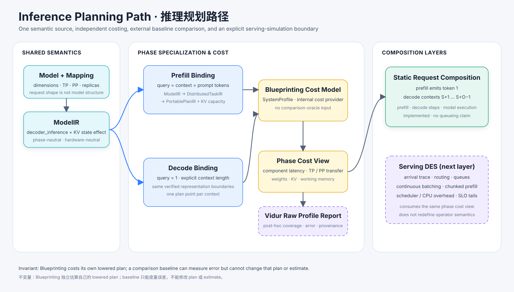

# 推理规划与 Serving 仿真

Blueprinting 现在已经具备一条可运行的 decoder inference 切片，但它的边界刻意窄于完整 serving-system simulator。当前路径回答的是硬件规划问题：**在明确 mapping 下，一个 prefill 或某个 context length 的 decode phase 会产生多少计算、通信、状态容量和静态延迟？** 它暂不声称能够预测排队、continuous batching 或 SLO tail。



## 从相关工作中吸收什么

[LLMCompass](https://arxiv.org/abs/2312.03134)说明，LLM 推理硬件评估需要分离 software、hardware、mapping 与 cost，并通过显式 mapping search 取代单一闭式模型。Blueprinting 吸收了这个分层：canonical representation 先保存 workload 与 mapping 事实，之后才允许 system profile 或测量 latency 参与。LLMCompass 的 area/cost 与 architecture design-space machinery 属于后续 provider 和 exploration 工作；本项目没有把其 artifact code 复制进 canonical IR。

[Vidur](https://github.com/microsoft/vidur)提供了另一条关键边界：request arrival、replica scheduling、batching 和 event progression 属于离散事件层，execution time 则由基于 profiling data 的 component predictor 提供。Blueprinting 吸收了这层分离：phase plan 是稳定的 cost subject；未来 serving simulator 在其上调度 request/batch，而不是在 scheduler 代码里重新定义 Transformer work。

由此得到的职责边界如下：

| 关注点 | 当前所有者 | 状态 |
|---|---|---|
| Transformer operation/byte/collective 推导 | canonical inference analysis | Implemented slice |
| Prefill 与 decode 特化 | workload binding + lowering passes | Implemented slice |
| KV-cache state 与容量 | ModelIR effect + portable state buffer + memory view | Implemented slice |
| 解析式 component cost | `SystemProfile` fallback | Implemented slice |
| Vidur profiling CSV 复用 | post-hoc exact-match baseline | Implemented experiment |
| 静态 decoder-block phase composition | inference application service | Implemented slice |
| Arrival、queue、continuous batching、scheduling | serving discrete-event simulator | Planned |
| 硬件 area、power、cost 与 mapping search | architecture provider 与 exploration session | Planned |

## 已实现的推导路径

Frontend 生成一个 phase-neutral 的 `transformer.decoder_inference` operation，并显式声明 KV-cache state effect。Phase workload binding 再对其特化：

```text
TransformerModelSpec
  + TransformerInferenceExecutionSpec(TP, PP, replicas, dtype, network tiers)
  + WorkloadBinding(INFERENCE, PREFILL | DECODE, batch, context)
  -> ModelIR
  -> DistributeTransformerInferencePass
  -> DistributedTaskIR
  -> PlanTransformerInferencePass
  -> PortablePlanIR
  -> estimate_inference_phase(Blueprinting cost provider | analytical model)
  -> optional post-hoc Vidur comparison
```

Component task 包括 input norm、QKV projection、RoPE、KV save、attention core、output projection、TP all-reduce、residual、post-attention norm、MLP up/activation/down、第二次 all-reduce 与最终 residual。这个边界既足以检查 work conservation，也能与 profiling system 中可观测的 kernel family 对齐。

Prefill 绑定 `query_tokens = context_tokens = prompt_tokens`。Decode 绑定 `query_tokens = 1`，并把 `context_tokens` 定义为追加当前 token 后 attention 可见的 key 数。每个 phase plan 保存精确 operations、read/write bytes、collective volume、phase、primitive、source layer、query/context length、block weight capacity、KV capacity 与保守 workspace buffer；它不携带 duration。Costing 只从 `PlanTask.workload` 与显式 buffer 重建 task view，不允许隐藏 lowering object 成为第二份 workload 真值。

## Request composition 语义

对于 prompt 长度 `S`、请求输出长度 `O` 的 cohort，当前 decoder-block dialect 组合一个 prefill phase 与 `O-1` 个 decode phase：

```text
prefill model time = cost(prefill(batch=B, query=S, context=S))
decode contexts = S+1, S+2, ..., S+O-1
model execution time = prefill model time + sum(cost(decode(batch=B, query=1, context=c)))
mean decode-step model time = decode total / (O-1), when O > 1
```

第一版逐个编译 decode context 是有意选择：size-dependent efficiency 不必关于 context 线性。Report 保留每个 decode plan digest 与 latency，并暴露 prefill 和最终 decode context 的完整 IR snapshot。由于 embedding、LM head、sampling、host work 与 queueing 都未建模，这些数值刻意不命名为 TTFT、TPOT 或 E2E。这是静态 model-phase composition，不是 serving trace simulation。

每设备容量从 mapping 推导。Dense MHA 的单个 local block shard KV 存储为：

```text
2 × batch × context × (hidden / TP) × bytes_per_element
```

该值乘以每个 pipeline stage 的 block 数。Weight storage 同样按 TP sharding、按 PP partition，pipeline boundary buffer 显式保留。由于 `PortablePlanIR` 尚未选择 FlashAttention、paged attention 或 unfused implementation，working memory 当前报告未融合 score materialization 的保守上界；target binding 必须用 implementation-specific workspace 替换该上界。当前路径要求 TP 整除 hidden、FFN 和 head dimension，并要求 PP 整除 block count。

## 把 Vidur 作为基线，而不是 estimator

`VidurProfileBaseline.from_csv(...)` 读取用户提供的 Vidur `attention.csv` 与 compute/MLP CSV。调用者必须固定 upstream revision、hardware identity、attention backend 与 cache block size。Adapter 把输入文件和 identity 一起哈希为 baseline revision，将 Vidur 的毫秒 median 转为秒；只有 model dimension、maximum sequence length、TP、batch/token shape、phase、backend、block size 与 context 完全匹配时才返回 reference。Vidur 的 decode `kv_cache_size` 表示当前 token 写入前的长度，而 Blueprinting 的 context 表示写入后 attention 可见的长度，因此 adapter 显式使用 `vidur_kv_cache_size = context_tokens - 1`。

```python
from blueprinting.analysis import VidurProfileBaseline
from blueprinting.system import SystemProfile
from blueprinting.synthesizer.bindings import InferencePhase
from blueprinting.synthesizer.experiments import VidurExperimentCase, run_vidur_experiment
from blueprinting.workload import TransformerInferenceExecutionSpec, TransformerModelSpec

baseline = VidurProfileBaseline.from_csv(
    attention_csv="/profiles/attention.csv",
    compute_csv="/profiles/mlp.csv",
    model_name="<exact Vidur model identity>",
    hardware_name="a100_80g",
    attention_backend="AttentionBackend.FLASH_ATTENTION",
    block_size=16,
    source_revision="<pinned Vidur commit>",
)
case = VidurExperimentCase(
    name="decode/context-128",
    model=TransformerModelSpec(...),
    execution=TransformerInferenceExecutionSpec(...),
    hardware=SystemProfile(...),
    phase=InferencePhase.DECODE,
    batch_size=1,
    context_tokens=128,
)
report = run_vidur_experiment((case,), baseline)
```

这个 API 边界是刻意设计的：Blueprinting 内部可接受的 `InferenceCostProvider` 暴露 `resolve()`，外部 `InferenceBaseline` 只暴露 `lookup()`。`run_vidur_experiment()` 会先完成 lowering 和两种 Blueprinting cost mode，再调用 `lookup()`；因此 Vidur 无法改变 operations、bytes、dependency、plan digest 或 estimated latency。

Comparison 只发生在显式 semantic intersection 上。Report 给出 matched component count、coverage、Blueprinting comparable subtotal、Vidur comparable subtotal、被排除的 Blueprinting work、signed comparable-subtotal error，以及不可相互抵消的 component MAPE/max error。缺失 record 保持 `not-covered`，绝不会被当作零。这个区别很重要：Vidur 公开的 block aggregation 只有一个 `add_time`，而 Blueprinting 刻意保留两个 residual addition；当前 CSV adapter 也尚未读取 collective profile。

Adapter 不做 nearest-neighbor 或隐藏插值。MHA workload 还要求 compute 与 attention record 的 query/KV head 数相等。Raw component-profile key 匹配并不证明完整 decoder topology 等价：当前 model spec 还没有编码 norm placement、residual topology 与 gated-MLP choice。Production inference estimate 完全由 Blueprinting 自己产生；Vidur 只是衡量这套机制还应在哪里改进的 oracle。

Blueprinting 不复制完整 upstream profiling corpus。仓库只保留一份 MIT-licensed Phi-2/A100 最小 validation slice，用于离线 CI，并固定 upstream commit、source blob ID、显式 projection rule 与本地文件 digest；更大规模实验继续让 Vidur 数据保持外部依赖。已实现的 `VidurProfileImporter` 会在用户显式把 profile 晋升为性能数据库 evidence 时规范化 unit、创建 raw-record ID，并保留 source revision/file digest。对于 upstream schema 没有提供的字段，完整 environment manifest 与 runtime/kernel identity 仍是后续必须补齐的 evidence 工作。

## Serving 层还必须增加什么

Vidur 风格的 serving simulator 应当消费 phase plan 与 evidence，而不是成为另一套 Transformer estimator。它的最小状态包括：

- immutable request record：arrival、prompt/output length、priority 与 SLO；
- replica 与 KV allocation state；
- 具有显式 batching/chunked-prefill 决策的 scheduler policy；
- admission、batch start/end、transfer、preemption 和 completion event queue；
- 与 device component evidence 分开的 CPU/scheduler overhead evidence；
- TTFT、inter-token latency、E2E、throughput、utilization 与 tail distribution。

Scheduler 产生 concrete batch context，再使用该 context 查询 cost resolver。这样 vLLM、Orca、Sarathi 或未来面向 LPU 的策略可以共享同一份 canonical workload semantic 与 hardware evidence interface。

## 当前限制

已实现 dialect 覆盖一个 dense-MHA、non-gated-MLP decoder template。Embedding、LM head、sampler、显式 norm/residual topology、GQA/MQA、gated MLP、MoE、prefix caching、paged allocation、chunked prefill、speculative decoding、prefill/decode disaggregation、scheduler overhead 与 resource contention 尚未建模。PP 与 replica structure 还没有完整物化到 `DistributedTaskIR`；PP latency/memory 当前是在 local-TP block plan 之后做解析式组合。每个 decode context 仍会独立推导，而不是从 parametric plan 做代数特化。`replicas` 当前只参与 mapping 合法性与 world-size 记账；报告的 latency 与 static model token rate 仍是单 replica 视角，不代表多 replica serving capacity。因此当前输出适合检查推导、解析显存 fit 和一阶硬件敏感性，不能作为 production serving SLO accuracy 的声明。
